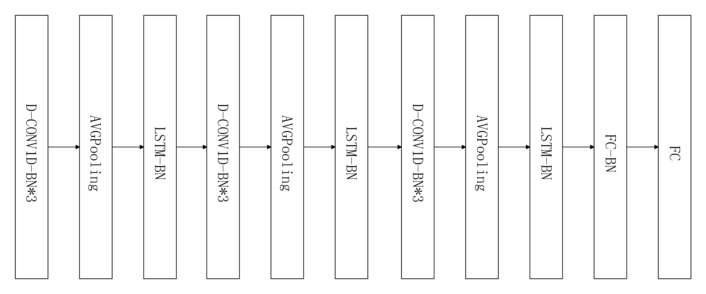
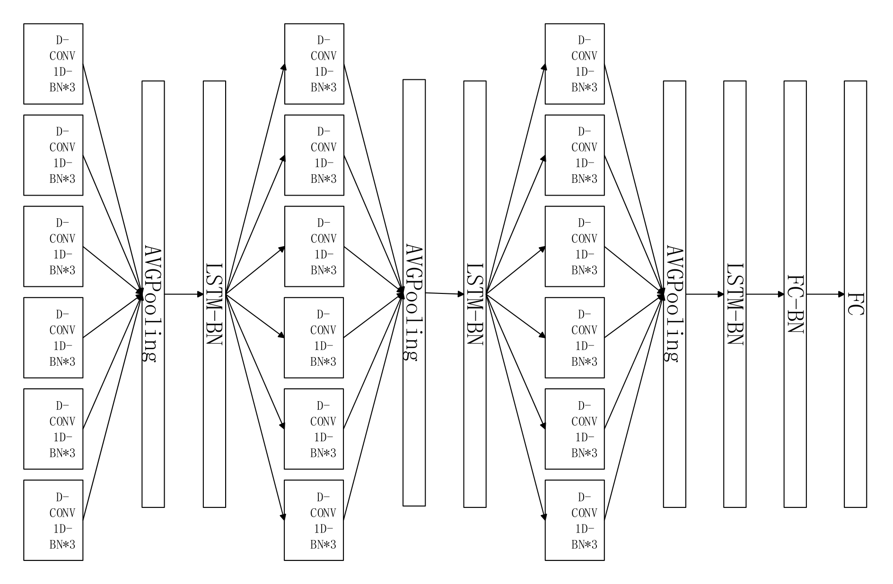
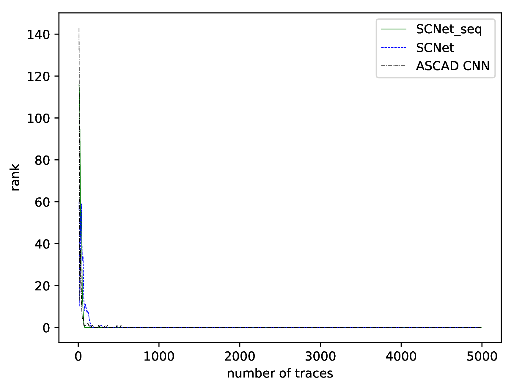
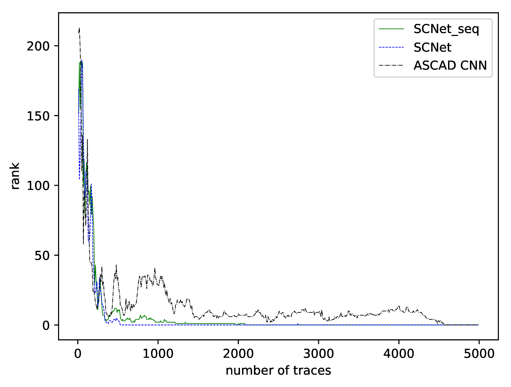
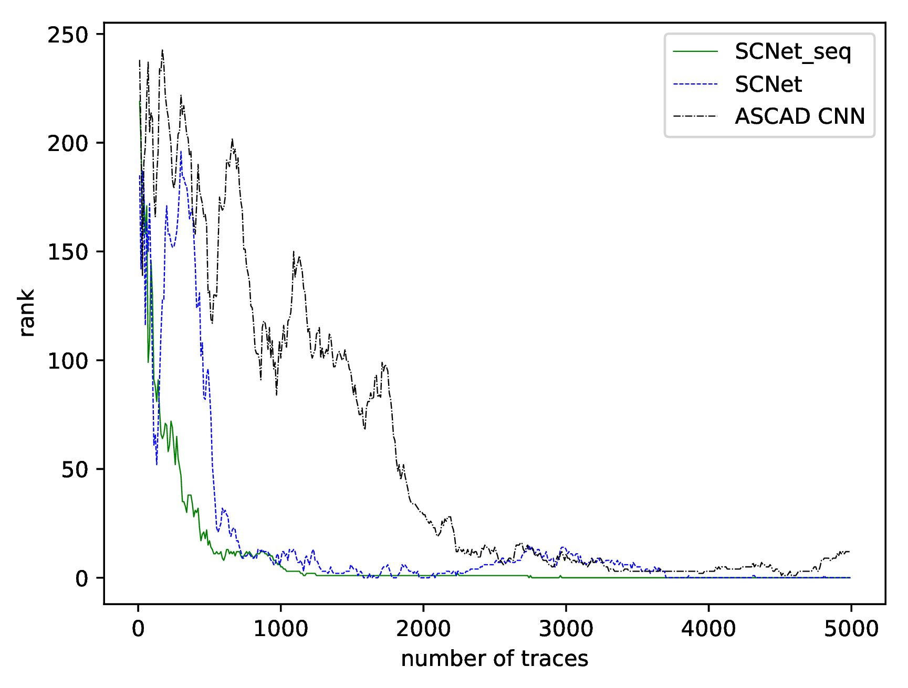
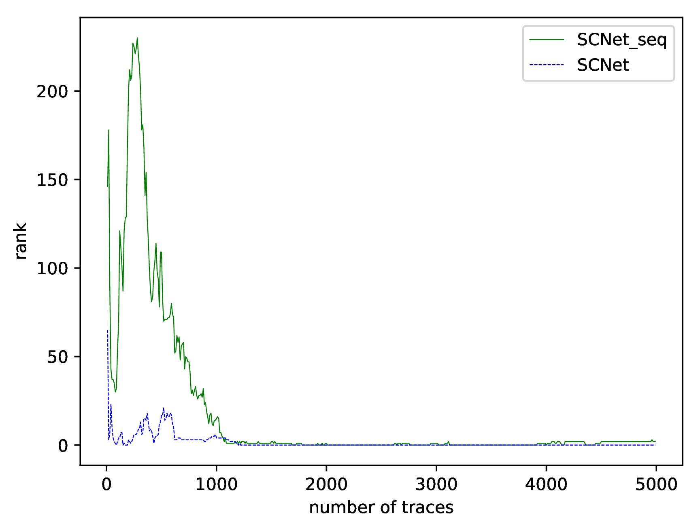

# SCNet: Neural networks for side channel attacks [[pdf]](https://arxiv.org/abs/2008.00476)


# Authors:
>Guanlin Li (leegl@sdas.org)
>
>Chang Liu (chang015@e.ntu.edu.sg)
>
>Han Yu (han.yu@ntu.edu.sg)
>
>Yanhong Fan (fanyh@sdas.org)
>
>Libang Zhang (zlb17@mails.tsinghua.edu.cn)
>
>Zongyue Wang (zongyue.wang@opsefy.com)
>
>Meiqin Wang (mqwang@sdu.edu.cn)

# Datasets:


### ASCAD dataset:
>https://github.com/ANSSI-FR/ASCAD
>
### DPA_v4.2 dataset:
>[DPA Tools](http://www.dpacontest.org/tools/tools.php)
>
>[DPA_v4.2 full version dataset](http://www.dpacontest.org/v4/42_traces.php)
>
>Firstly, download and install the DPA Tools. There are two versions for Win and Unix(Linux and MacOS) respectively.
Then, download the index file and traces and unzip the traces into 16 folders respectively.
>
```
path  
│
└───k00
│      DPACV42_000000.trc.bz2
│      ...
│      DPACV42_004999.trc.bz2
│    
│   
└───k01
│      DPACV42_005000.trc.bz2
│      ...
│      DPACV42_005000.trc.bz2
│
└───...    
│    
│
│
│
└───k15
        DPACV42_075000.trc.bz2
        ...
        DPACV42_079999.trc.bz2
    
```
>
>Change the path in read_trace.py depending on your OS.
```
python read_trace.py
``` 
>It will spend about 5 days processing all the traces. After finishing processing the traces, change the path in data_gen.py.
You can decide which key byte you want to restore and change the target_points corresponding to it. The default profile
corresponds to the 11-th byte with 500 target_points.
```
pip install h5py numpy
python data_gen.py
``` 
>You can use our [DPA dataset](https://www.dropbox.com/s/lqrfgqxy0gyrbwx/DPA.h5?dl=0) directly if you don't want to change any thing about the attack. It is only 38MB and
is handy for ML researchers to use. 


# Models:

>We provide trained models on four datasets, three of them from ASCAD and one from DPA_v4.2, respectively.
Our experiment environment is [tensorflow-gpu](https://www.tensorflow.org/)==1.8.0, [keras](https://keras.io/)==2.2.2, [CUDA 9.1.85](https://developer.nvidia.com/cuda-toolkit), [cuDNN 7.0](https://developer.nvidia.com/cudnn). We strongly recommend using
[Anaconda3](https://www.anaconda.com/) to install them. 

###### With pip to install (you need to install CUDA and cuDNN by yourself):
```
pip install tensorflow-gpu keras matplotlib
``` 
###### With conda to install:
```
conda install tensorflow-gpu==1.8.0
conda install keras
``` 
>
>If you want to train your own models, just make sure all paths are correct and
>
>on three datasets of ASCAD
```
python ASCAD_train_models_v1.py
``` 
>or
```
python ASCAD_train_models_v2.py
``` 
>on DPA_v4.2
```
python DPA_train_models_v1.py
``` 
>or
```
python DPA_train_models_v2.py
``` 
>
>After finishing training, you can visualize the result on testset with a script
>
>on three datasets of ASCAD
```
python ASCAD_test_models_v1.py
``` 
>or
```
python ASCAD_test_models_v2.py
``` 
>on DPA_v4.2
```
python DPA_test_models_v1.py
``` 
>or
```
python DPA_test_models_v2.py
``` 

### SCNet_seq structure:

 

### SCNet structure:
 

# Results:

###### Result on ASCAD.h5:
 
###### Result on ASCAD_desync50.h5:
 
###### Result on ASCAD_desync100.h5:
 
###### Result on DPA.h5:
 


| Model Name     | ASCAD Desync0 Requires | ASCAD Desync50 Requires  |ASCAD Desync100 Requires  |DPA_v4.2 Desync0 Requires  |
| :---:          | :----:                 | :----:                   | :----:                   | :----:                    |
| **ASCAD CNN**  | 150                    | 4570                     |None                      |None                       |
| **SCNet_seq**  | **80**                 | 1970                     |**2760**                  |1690                       |
| **SCNet**      | 160                    | **530**                  |3700                      |**1200**                   |


# Notice:
>We test our code on both Windows 7 and Ubuntu 16.04.
>
>SCNet_v1 &rarr; SCNet_seq
 > 
>SCNet_v2 &rarr; SCNet


# Cite:
>If you use this code, please cite our paper:
 
```
@ARTICLE{2020arXiv200800476L,
       author = {{Li}, Guanlin and {Liu}, Chang and {Yu}, Han and {Fan}, Yanhong and
         {Zhang}, Libang and {Wang}, Zongyue and {Wang}, Meiqin},
        title = "{SCNet: A Neural Network for Automated Side-Channel Attack}",
      journal = {arXiv e-prints},
     keywords = {Computer Science - Cryptography and Security, Computer Science - Machine Learning},
         year = 2020,
        month = aug,
          eid = {arXiv:2008.00476},
        pages = {arXiv:2008.00476},
archivePrefix = {arXiv},
       eprint = {2008.00476},
 primaryClass = {cs.CR},
       adsurl = {https://ui.adsabs.harvard.edu/abs/2020arXiv200800476L},
      adsnote = {Provided by the SAO/NASA Astrophysics Data System}
}
```
>This code is for protyping research ideas; thus, please use this code only for non-commercial purpose only.  


# Credits:
>The part of the base codes are borrowed from 
[ANSSI-FR/ASCAD](https://github.com/ANSSI-FR/ASCAD).
Thanks for their standardizing implementation of training and test scripts and datasets.

```
@misc{cryptoeprint:2018:053,
    author = {Emmanuel Prouff and Remi Strullu and Ryad Benadjila and Eleonora Cagli and Cecile Dumas},
    title = {Study of Deep Learning Techniques for Side-Channel  Analysis and Introduction to ASCAD Database},
    howpublished = {Cryptology ePrint Archive, Report 2018/053},
    year = {2018},
    note = {\url{https://eprint.iacr.org/2018/053}},
}
```

